# Bomberman en RISC-V (RARS)

Reescritura completa de un Bomberman clásico, programado enteramente en ensamblador **RISC-V de 32 bits**, pensado para correr en el simulador [RARS](https://github.com/TheThirdOne/rars) 1.6. Es el Proyecto 2 del curso EL-3310 (Diseño de Sistemas Digitales), y su `.text`/`.data` compilados sirven además como carga de trabajo para validar dos emuladores RISC-V propios (uno en NASM x86-64, otro en C).

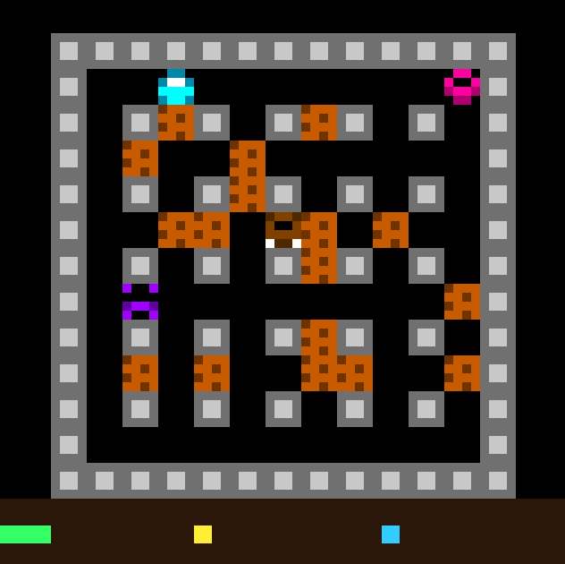

---

## Tabla de contenidos

- [Cómo correrlo](#cómo-correrlo)
- [Controles](#controles)
- [Arquitectura general](#arquitectura-general)
- [El framebuffer y la pantalla](#el-framebuffer-y-la-pantalla)
- [El mapa y las celdas](#el-mapa-y-las-celdas)
- [El HUD](#el-hud)
- [Flujo del juego](#flujo-del-juego)
- [El loop principal, frame a frame](#el-loop-principal-frame-a-frame)
- [Bombas y explosiones](#bombas-y-explosiones)
- [Enemigos](#enemigos)
- [Power-ups](#power-ups)
- [Vidas e invulnerabilidad](#vidas-e-invulnerabilidad)
- [Niveles](#niveles)
- [Distribución de memoria (`.data`)](#distribución-de-memoria-data)
- [Sprites con textura](#sprites-con-textura)
- [Ajustar la velocidad y el ritmo del juego](#ajustar-la-velocidad-y-el-ritmo-del-juego)
- [Estructura del código](#estructura-del-código)

---

## Cómo correrlo

1. Abrí RARS 1.6 (`java -jar rars1_6.jar`).
2. Cargá `bomberman.asm` (`File > Open`).
3. Abrí el **Bitmap Display** (`Tools > Bitmap Display`) y configuralo así:
   - **Unit Width / Unit Height:** `8`
   - **Display Width / Display Height:** `512`
   - **Base Address:** `.data` (Global Pointer / `gp`)
4. Ensamblá y corré (`Assemble`, luego `Run`).
5. Vas a ver una pantalla azul sólida: presioná **ESPACIO** para arrancar la partida.

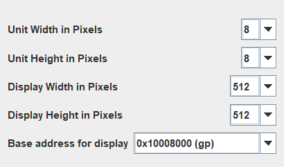

---

## Controles

| Tecla | Acción |
|---|---|
| `W` | Mover arriba |
| `A` | Mover izquierda |
| `S` | Mover abajo |
| `D` | Mover derecha |
| `ESPACIO` | Colocar bomba / Empezar partida / Reiniciar tras Game Over o Victoria |

---

## Arquitectura general

El juego corre como un único **loop principal** (`loop_principal`) que se repite continuamente. Cada vuelta del loop es un "frame": procesa la física del mundo (bombas, explosiones, enemigos), lee el teclado, mueve al jugador, resuelve colisiones, y espera un rato antes de la próxima vuelta.

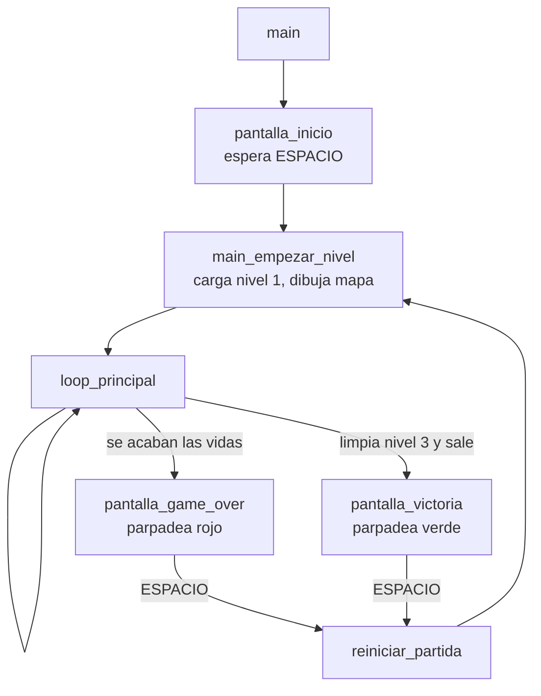

Un detalle importante de diseño: **`pantalla_inicio` solo se muestra una vez**, al arrancar RARS. Cuando el jugador pierde o gana y presiona ESPACIO, el juego salta directo a `main_empezar_nivel` — no hace falta parar y volver a correr la simulación para jugar de nuevo.

---

## El framebuffer y la pantalla

RARS dibuja el Bitmap Display como una grilla de **64×64 "unidades"** (cada unidad = 8×8 píxeles reales, con `Unit Width/Height = 8` sobre una pantalla de 512×512px). Todo el código de dibujo trabaja en estas unidades, no en píxeles reales.

Cada **tile de juego** (una celda del mapa) mide **4×4 unidades** (`TILE_SIZE = 4`), es decir 32×32 píxeles reales. El mapa jugable es de **13×13 tiles**, lo que ocupa 52×52 unidades de las 64×64 disponibles.

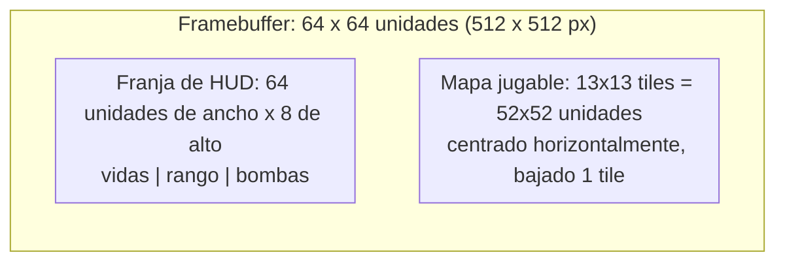

El mapa **no** arranca en la esquina (0,0) del framebuffer: se centra horizontalmente y se desplaza 1 tile hacia abajo, dejando toda la franja inferior libre para el HUD. Esto se logra con un **offset global de pantalla** (`pantalla_offset_x = 6`, `pantalla_offset_y = 4`, en unidades) que se suma dentro de `calcular_posicion_fb` a toda coordenada de dibujo del mundo del juego. El HUD, en cambio, se dibuja en coordenadas absolutas (offset puesto en `0,0` temporalmente mientras se pinta), porque debe ocupar toda la franja inferior sin que el desplazamiento lo afecte.

---

## El mapa y las celdas

El mapa es un arreglo de 13×13 palabras (`mapa_nivel`, una por celda), donde cada palabra combina dos campos:

```
bits [7:0]   -> tipo de celda
bits [15:8]  -> power-up oculto (solo aplica si el tipo es DESTRUCTIBLE)
```

**Tipos de celda:**

| Valor | Constante | Significado |
|---|---|---|
| 0 | `CELDA_VACIA` | Transitable |
| 1 | `CELDA_INDESTRUCTIBLE` | Bloque de acero, nunca se destruye |
| 2 | `CELDA_DESTRUCTIBLE` | Bloque de ladrillo, puede destruirse con una explosión |
| 3 | `CELDA_SALIDA` | Escalera de salida (oculta hasta revelarse) |
| 4 | `CELDA_BOMBA` | Hay una bomba activa en esa celda |
| 5 | `CELDA_EXPLOSION` | Hay fuego activo en esa celda |

**Power-ups ocultos bajo bloques destructibles:**

| Valor | Constante | Efecto al recogerlo |
|---|---|---|
| 0 | `POWERUP_NINGUNO` | — |
| 1 | `POWERUP_LLAMA` | +1 de rango de explosión (tope 5) |
| 2 | `POWERUP_BOMBA_EXTRA` | +1 bomba simultánea (tope 8) |
| 3 | `POWERUP_VIDA_EXTRA` | +1 vida (tope 9) |
| 4 | `POWERUP_SALIDA_OCULTA` | Revela la salida al destruir el bloque |

Los 3 mapas (uno por nivel) están **pre-generados y verificados por código** (conectividad comprobada con búsqueda en anchura / BFS, para garantizar que el jugador y los 3 enemigos siempre puedan alcanzarse entre sí, aunque sea rompiendo bloques) y quedan escritos como datos literales (`mapa_nivel_1/2/3`) dentro del `.asm`.

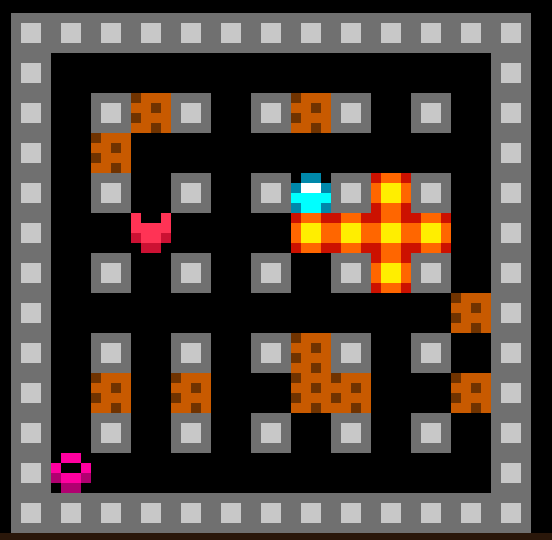

---

## El HUD

Una sola franja horizontal, a todo el ancho de la pantalla (64 unidades), dividida en 3 columnas iguales. Cada valor se muestra como una fila de cuadraditos de colores (no números), al estilo "vidas = corazones":

| Columna | Color | Representa | Tope |
|---|---|---|---|
| Izquierda (0–22) | Verde | Vidas | 9 |
| Centro (22–43) | Amarillo | Rango de explosión | 5 |
| Derecha (43–64) | Celeste | Bombas simultáneas | 8 |

---

## Flujo del juego

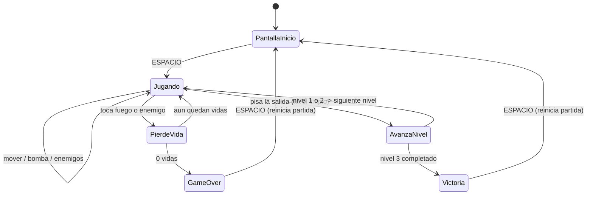

Una regla clásica de Bomberman que se respeta acá: **la salida solo funciona si ya no quedan enemigos vivos** en el nivel actual, aunque esté visible.

---

## El loop principal, frame a frame

Cada vuelta de `loop_principal` hace, en este orden:

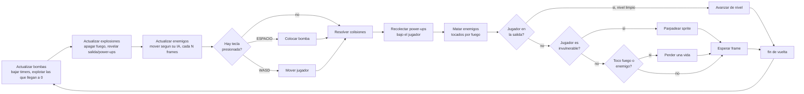

Todo el mundo (bombas, explosiones, enemigos) se actualiza **siempre**, tenga o no el jugador una tecla presionada — así el juego no se "congela" mientras el jugador piensa su próximo movimiento.

---

## Bombas y explosiones

- El jugador coloca una bomba en su celda actual con `ESPACIO` (si no superó su límite de bombas simultáneas).
- Cada bomba tiene un temporizador (`BOMBA_TIMER_INICIAL` frames) antes de explotar sola.
- Al explotar, genera fuego en su propia celda y se extiende en las 4 direcciones cardinales hasta `jugador_rango` celdas, deteniéndose al chocar contra un bloque indestructible o la salida (sin destruirlos) o destruyendo el primer bloque destructible que encuentra en cada dirección (sin seguir más allá).
- Si un bloque destructible tenía un power-up o la salida oculta debajo, se revela **recién quedar apagado el fuego** (no de inmediato), para que no se mezcle visualmente con la animación de la explosión.
- El fuego dura `EXPLOSION_TIMER_INICIAL` frames visible y luego se apaga.
- Una explosión puede encender otras bombas en cadena.

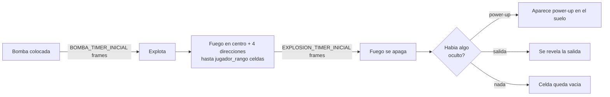

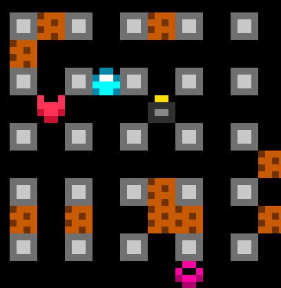

---

## Enemigos

Hay 3 tipos, cada uno con su propio color/sprite e IA:

| Tipo | Color | Comportamiento |
|---|---|---|
| Recto | Rosa | Camina en línea recta hasta chocar con algo, ahí cambia de dirección |
| Aleatorio | Violeta | Además de cambiar al chocar, puede cambiar de dirección al azar en cualquier tile |
| Perseguidor | Marrón | Prioriza moverse hacia la posición del jugador; si no puede, usa una dirección secundaria |

Los enemigos se mueven más lento que el jugador: solo una vez cada `ENEMIGO_MOVIMIENTO_INTERVALO_FRAMES` frames (el jugador se mueve inmediatamente al presionar una tecla). Mueren si el fuego de una explosión los alcanza. El nivel se considera "limpio" (y la salida se activa) recién cuando **todos** los enemigos del nivel están muertos.

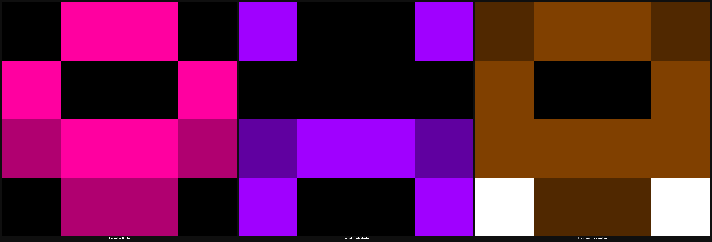

---

## Power-ups

Aparecen en el suelo al destruir un bloque que los tenía ocultos, y se recogen caminando sobre ellos:

| Power-up | Sprite | Efecto |
|---|---|---|
| Llama | Gota de fuego naranja/amarilla | +1 rango de explosión (tope 5) |
| Bomba extra | Bombita celeste/azul | +1 bomba simultánea (tope 8) |
| Vida extra | Corazón rojo | +1 vida (tope 9) |

Las mejoras de rango y bombas máximas **persisten entre niveles** (no se resetean al pasar de nivel, solo al perder todas las vidas o ganar la partida completa).

---

## Vidas e invulnerabilidad

Al tocar fuego o un enemigo (y no ser ya invulnerable), el jugador pierde una vida y:

1. Vuelve al punto de spawn del nivel.
2. Se vuelve invulnerable por `JUGADOR_INVULN_FRAMES` frames — puede caminar sobre fuego o enemigos sin perder otra vida durante ese tiempo.
3. Su sprite parpadea (aparece/desaparece cada `INVULN_PARPADEO_INTERVALO` frames) como señal visual de que está protegido.

Si la vida perdida era la última, el juego pasa a la pantalla de Game Over.

---

## Niveles

Hay 3 niveles de dificultad creciente (más bloques destructibles, mapas más cerrados). Al completar un nivel (todos los enemigos muertos + salida usada):

- Se avanza a `nivel_actual + 1` y se carga su mapa fijo.
- Bombas, explosiones, power-ups en el suelo y enemigos del nivel anterior se limpian.
- El jugador vuelve al punto de spawn.
- **Vidas, rango de explosión y bombas máximas del jugador NO se resetean** — el progreso de equipamiento continúa entre niveles.

Al completar el nivel 3, el juego pasa a la pantalla de Victoria.

---

## Distribución de memoria (`.data`)

Las estructuras de datos más importantes del segmento `.data`:

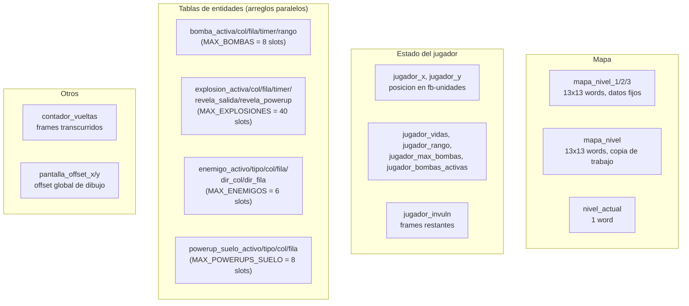

Cada tabla de entidades usa el patrón clásico de **arreglos paralelos**: la entidad en el índice `i` de `bomba_activa` corresponde al mismo índice `i` en `bomba_col`, `bomba_fila`, etc. Un slot con `activo = 0` está libre y se puede reutilizar.

---

## Sprites con textura

Todos los elementos visuales (jugador, los 3 enemigos, bomba, los 3 power-ups, explosión, y los bloques destructible/indestructible) se dibujan como sprites de **4×4 fb-unidades** (una tabla de 16 colores, fila por fila), en vez de un color plano. La función `pintar_sprite_16` recorre cualquiera de estas tablas y pinta cada unidad con su color correspondiente.

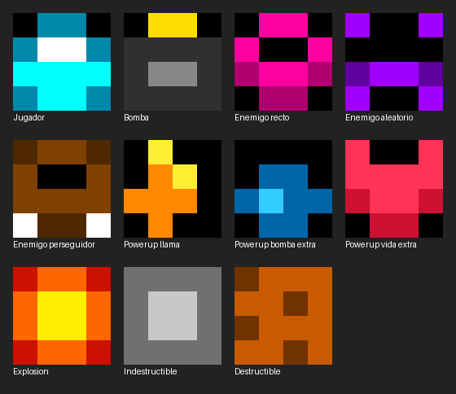

---

## Ajustar la velocidad y el ritmo del juego

Todo el timing del juego se mide en **"frames"** (vueltas del `loop_principal`), no en tiempo real. Hay un único reloj global y varios temporizadores relativos a él:

| Constante | Qué controla |
|---|---|
| `FRAME_DELAY_CICLOS` | Duración de un frame (busy-wait). Afecta la velocidad de **todo** el juego por igual. |
| `BOMBA_TIMER_INICIAL` | Frames hasta que una bomba explota sola. |
| `EXPLOSION_TIMER_INICIAL` | Frames que el fuego permanece visible. |
| `ENEMIGO_MOVIMIENTO_INTERVALO_FRAMES` | Cada cuántos frames se mueven los enemigos (más alto = más lentos). |
| `JUGADOR_INVULN_FRAMES` | Frames de invulnerabilidad tras perder una vida. |
| `INVULN_PARPADEO_INTERVALO` | Cada cuántos frames alterna la fase de parpadeo. |

Cambiar `FRAME_DELAY_CICLOS` acelera o frena todo el juego por igual (como cambiar la velocidad de reproducción de un video). Cambiar un timer individual afecta solo esa mecánica, en relación a las demás.

---

## Estructura del código

El archivo está organizado en secciones, en este orden:

1. **Constantes (`.eqv`)** — geometría de pantalla, timing, colores, tipos de celda/power-up.
2. **Datos (`.data`)** — tablas de sprites, mapas de los 3 niveles, y todo el estado mutable descrito arriba.
3. **Código (`.text`)**, agrupado por responsabilidad:
   - `main` / `main_empezar_nivel` / `loop_principal` — orquestación general.
   - `pantalla_inicio` / `pantalla_game_over` / `pantalla_victoria` / `pantalla_fin_parpadeo` — pantallas de transición.
   - `calcular_posicion_fb` / `pintar_unidad` / `pintar_bloque_fb` / `pintar_sprite_16` — primitivas de dibujo de bajo nivel.
   - `redibujar_celda` / `redibujar_terreno_celda` / `pintar_mapa` — dibujo de alto nivel de cada celda del mapa.
   - `pintar_fondo_hud` / `pintar_contador_hud` / `pintar_hud_completo` — dibujo del HUD.
   - `mover_jugador` / `hay_colision_mapa` — movimiento y colisión del jugador.
   - `colocar_bomba` / `explotar_bomba` / `explotar_direccion` / `actualizar_bombas` / `actualizar_explosiones` — sistema de bombas y fuego.
   - `spawn_enemigo` / `mover_enemigo` / `actualizar_enemigos` / `elegir_direccion_aleatoria` / `elegir_direccion_persecucion` — IA de enemigos.
   - `crear_powerup_suelo` / `recolectar_powerups` — power-ups.
   - `perder_vida` / `parpadear_jugador` / `actualizar_invulnerabilidad` — vidas e invulnerabilidad.
   - `cargar_nivel` / `avanzar_nivel` / `nivel_limpio` / `reiniciar_partida` — progresión de niveles y reinicio de partida.

---

## Créditos

Desarrollado por Sergio Zapata Villalobos como Proyecto 2 del curso EL-3310 (Diseño de Sistemas Digitales), Instituto Tecnológico de Costa Rica. El `.text`/`.data` generados por este programa también se usan como carga de trabajo de validación para dos emuladores RISC-V propios ([`emulador-riscv-x86`](https://github.com/Sergiozapata13/emulador-riscv-x86) en NASM x86-64, y [`emulador-riscv-c`](https://github.com/Sergiozapata13/emulador-riscv-c) en C).
